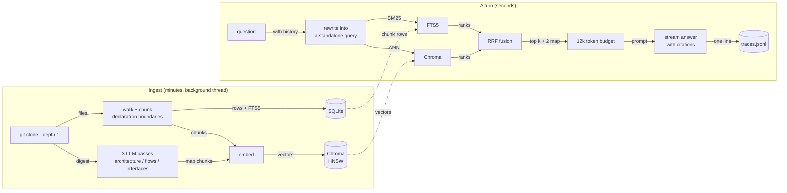

# repo-oracle

Ask a codebase a question, get an answer where every claim links to the line it came from.

Point it at a GitHub URL. It clones the repo, splits it on declaration boundaries, embeds the
chunks, writes a short architectural summary of the whole repository, and indexes both.
Then you talk to it. Click any citation and that file opens at that line, beside the answer.

Built for the AI-FDE assignment, option 2.


**[One-minute demo](docs/demo.mp4)**, against `psf/requests`. Five questions, each covering
one thing: the end-to-end architecture (what the summary tier is for), a specific lookup plus
two citation clicks, a follow-up that retrieves nothing on its own ("and how many does it
allow before giving up?", answered `max_redirects` = 30), the config surface, and finally a
question the repo has no answer for, where it declines and names the terms it would grep for.

## Quick start

Needs Docker and a Gemini key, free from https://aistudio.google.com/apikey

```bash
git clone https://github.com/pronoy1004/repo-oracle && cd repo-oracle
echo "GEMINI_API_KEY=your-key" > .env
docker compose up --build
```

Open http://localhost:8000, paste a GitHub URL, wait for the index, ask. One container, one
port: the API serves the built UI, so there is nothing else to run and no CORS to configure.
It runs as a non-root user and keeps its indexes in a named volume.

### Without Docker

```bash
python3 -m venv .venv && .venv/bin/pip install -r requirements-dev.txt
export GEMINI_API_KEY=your-key
.venv/bin/uvicorn repo_oracle.app:app --port 8000    # API on :8000
cd web && npm install && npm run dev                 # UI on :5173, proxies to the API
```

Tests need no key and touch no network: `.venv/bin/python -m pytest -q` (36 passing).

### How long ingest takes

| Repo | Chunks | Files | Ingest |
|---|---|---|---|
| `psf/requests` | 414 | 114 | 8m03s, measured |
| `pallets/flask` | 837 | 218 | ~15 min, extrapolated |
| `tiangolo/fastapi` | 15,258 | 2,709 | exceeds the 12k cap, hours |

Almost all of that is the free tier's embedding limit, not work this code does. A paid key
with `ORACLE_EMBED_RPM=1500` cuts it roughly fifteen times. FastAPI is the honest failure
case: it blows through `ORACLE_MAX_CHUNKS`, indexes the first 12,000 and marks itself
truncated.

## Architecture



More diagrams, including a sequence diagram per flow, the module graph and the data model:
[docs/codebase-map/diagrams.md](docs/codebase-map/diagrams.md). I generated them with
[`draw-diagrams`](https://github.com/pronoy1004/codebase-cartography/blob/main/skills/draw-diagrams/SKILL.md),
one of the Agent Skills from my
[codebase-cartography](https://github.com/pronoy1004/codebase-cartography) project, pointed at
this repo.

| File | Owns |
|---|---|
| [`checkout.py`](repo_oracle/checkout.py) | Getting a repo on disk safely |
| [`chunk.py`](repo_oracle/chunk.py) | Walking the tree, cutting files into chunks |
| [`index.py`](repo_oracle/index.py) | Chroma for vectors, SQLite + FTS5 for chunks, RRF over both |
| [`mapper.py`](repo_oracle/mapper.py) | The repository-summary tier |
| [`chat.py`](repo_oracle/chat.py) | A turn: rewrite, retrieve, budget, stream |
| [`ingest.py`](repo_oracle/ingest.py) | Orchestration and progress events |
| [`app.py`](repo_oracle/app.py) | HTTP and SSE |
| [`trace.py`](repo_oracle/trace.py) | One JSON line per turn |
| [`web/`](web) | React UI: repos, chat, source panel |

Every module opens with a comment saying why it exists. Those are the long form of what
follows.

## Decisions

| Decision | Considered | Chose | Why |
|---|---|---|---|
| LLM | Claude Sonnet, GPT-4o-class, local Llama, Gemini Flash | Gemini Flash via litellm | Sonnet is better at this and is what I would run on my own key. Gemini has a free tier, so you can run this in a minute without a card |
| Embeddings | OpenAI, Voyage `voyage-code-3`, local `bge`, Gemini | `gemini-embedding-2` at 768 dims | Voyage is probably better on code and needs a second vendor account. Gemini is the same key as the LLM, which halves setup |
| Vector DB | numpy brute force, Chroma, Qdrant, pgvector | Chroma, embedded | A real ANN index with no service to operate. Qdrant and pgvector are this design with a container in front |
| Lexical | skip it, Elasticsearch, SQLite FTS5 | FTS5, in stdlib | Half of code questions are identifier lookups, where embeddings are actively worse |
| Orchestration | LangChain, LlamaIndex, Haystack, none | None | The pipeline is six functions. A framework adds more code than it removes |
| Chunking | fixed windows, tree-sitter, declaration regex | Regex with window fallback | Code has visible boundaries. A grammar per language is not paid for yet |

### Two tiers, because questions come in two shapes

"Where is the rate limiting done?" comes out of one chunk. Classic RAG handles it.

"How does a request get from the router to the database?" does not, because that answer is
not written down anywhere. It lives across a route, a middleware, a service and a model, and
an embedding of the question is close to none of them. Retrieval returns five plausible
chunks and the model writes a confident, wrong story over them.

So ingestion writes the missing documents. Three passes over a digest of the repo produce an
architecture note, a flows note and an interfaces note, indexed alongside the code as
`tier="map"`. They are marked `[map]` in the prompt and amber in the UI, and the prompt tells
the model to prefer source when both say the same thing. Model output about the repo is not
the repo, and the interface should never blur the two.

### Chunking on declarations

A function cut in half retrieves badly and reads worse in the context window. Code has
boundaries prose does not, so a per-language regex finds top-level `def`, `class`, `func`,
`impl` and friends. Small neighbours merge, so a three-line function is not its own chunk.
Anything oversized falls back to overlapping windows.

It is a regex, not a parser, and the file says so. Tree-sitter is more correct and costs a
grammar per language plus a build step. An eval hit-rate drop traced to a bad split is what
would buy it.

Every chunk carries `path:start-end` as the first line of the embedded text. Half of "where
is the router configured" is a path question, and it means a hit can be cited without a
second lookup.

### Chroma for vectors, SQLite for the rest

My first build had no vector database: embeddings as blobs in SQLite, a numpy matmul for
cosine. At 20k chunks that is a few milliseconds, faster than a network hop, and I argued for
it in an earlier version of this file.

I changed my mind, because it is the wrong thing to own. Nearest-neighbour search is solved,
and hand-rolled brute force is the version that quietly degrades: fine at 20k vectors,
mediocre at 100k, and by then you are rewriting retrieval in the middle of something else.

It cost one large dependency, two stores to keep consistent, and approximate rather than
exact recall. `add` commits SQLite before Chroma on purpose: that order can leave a chunk
only lexical search reaches, while the reverse leaves a vector id resolving to nothing, which
is a silent wrong answer.

### Hybrid retrieval, fused by RRF

Dense retrieval is worst at exactly what developers type. Ask for `REDIS_URL` and an
embedding blurs it into "something about caching". Lexical is worst when you do not know the
vocabulary yet, which is most of day one. Both run.

Reciprocal Rank Fusion merges them, rather than weighted scores, because BM25 ranks and
cosine similarities are not comparable and any normalising constant needs retuning per corpus
and will not get it. RRF reads ranks only.

One detail: FTS5 has its own query language and a question is not written in it. `fts_query`
strips stopwords, quotes each term, ORs them, and splits `getUserById` so it also matches a
file that says `get_user_by_id`.

### No orchestration framework

The assignment names this, so here is the reasoning rather than a preference.

LangChain and LlamaIndex would give me a loader, a splitter, a store adapter, a retriever
interface and a chain. What this system does is a git clone, a file walk, a regex splitter,
one `collection.add`, one `collection.query`, a rank fusion and a prompt. Six functions.

A framework buys swappability I do not need yet. It costs an abstraction between me and the
two things that decide whether this works: exactly what text is embedded, and exactly what
reaches the context window. The specific failure I avoided is a retriever that normalises
scores to rank hybrid results, when the whole reason my fusion works is that it never
compares BM25 to cosine.

The answer flips at agentic retrieval. Once the model should decide to grep, read, then
search again, a tool-calling loop is real infrastructure worth adopting. litellm is an
adapter at the boundary, not a skeleton through the middle.

### Three things models taught me the hard way

1. Gemini embeddings return 3072 dimensions. Matryoshka training means truncating to 768
   keeps most of the quality at a quarter of the memory. Free 4x.
2. Gemini Flash thinks by default, and thinking tokens bill against `max_tokens`. My first
   run spent a 2048 budget entirely on reasoning and returned an empty string.
   `reasoning_effort="disable"` fixes it. This is grounded synthesis, not a puzzle.
3. That fix broke Gemini 2.0 Flash, which rejects the parameter outright. litellm's
   `drop_params` is what makes `ORACLE_MODEL` a real choice rather than the three models I
   happened to test.

### Prompt and context

The system prompt does three jobs, kept separate: ground the answer in the excerpts, cite
constantly, treat excerpts as data rather than instructions. Grounding matters most. The
failure it prevents is not invented syntax, it is a confident answer about how the framework
usually works when this repo does something else.

Context is 12k tokens, estimated at four characters per token. Not a tokenizer, which is a
dependency and a per-provider difference, and the estimate only needs to be right within
about 15% because the chunk it drops is the least relevant one. One oversized chunk is
skipped rather than allowed to end the loop, so a 400-line file cannot starve five good small
ones.

History is server side, last 20 messages, last 6 sent to the model. Follow-ups are rewritten
into standalone queries first, which does more for answer quality than anything else in a
turn. If that call fails, the turn continues with the raw question.

### Guardrails

| Risk | What is done |
|---|---|
| Cloning something that is not a repo | Only http and https. `file://` and `ssh://` let git read local paths or run a command |
| Ref as argument injection | Strict regex, so a leading `-` cannot become an option. Never through a shell |
| Reading the host filesystem | Local paths refused unless `ALLOWED_REPO_ROOTS` names them. Unset by default and in the container |
| Traversal and symlinks | Paths resolved before the containment check |
| Secrets in the index | `.env`, `*.pem`, `*.key` indexed by name, contents replaced by a placeholder |
| Prompt injection from the repo | Excerpts labelled untrusted. A file addressing the model is quoted and reported, not obeyed |
| Runaway ingest | Caps on files, chunks, file size and clone time |
| Open API | `ORACLE_API_KEY` guards every route but `/healthz`. Unset means no auth, right for a laptop and wrong anywhere else |

### Observability

One JSON line per turn in `data/traces.jsonl`: question, rewritten query, every retrieved
chunk with score and tier and which retriever found it, context size, parsed citations, and
per-stage latency. `GET /traces/recent` reads them back.

RAG fails quietly. The answer is fluent, the retrieval was wrong, and the transcript will not
tell you which. The trace answers the first question worth asking about a bad answer: did
retrieval miss, or did the model ignore what it was handed? Different bugs, different fixes.

### Quality

18 hand-written questions with the files a human would open to answer each.
`evals/run.py` scores retrieval, not answers, because answer quality is expensive to judge
and moves with the model, while retrieval either put the right file in the window or did not.

```
questions      18      hit@5   94%
top-1 hit      44%     MRR     0.66
```

The evals caught two bad ideas of mine, which is the reason they exist. Both were about how
the summary tier reaches the model:

| Design | hit@5 | MRR |
|---|---|---|
| Score boost for map chunks (x1.15) | 89% | 0.43 |
| Reserved map slots inside the top k | 89% | 0.59 |
| Map slots in addition to the top k | 94% | 0.66 |

The same mistake twice: letting summaries compete with source files for the same slots.
Neither bad version showed up in the answers, which read fine both times.

One honesty note. The earlier brute-force build scored hit@5 100% and MRR 0.64 on these
questions, so hit@5 lost one while MRR and top-1 rose. I cannot attribute that cleanly,
because the move to Chroma and a change of embedding model landed together.

## Productionizing

1. **Get ingest out of a thread.** Fine for one user, wrong for two: a restart loses
   in-flight work and a big repo starves the event loop's thread pool. A queue (SQS or Cloud
   Tasks) plus workers that scale separately from the API. A long clone-and-embed job and a
   two-second turn have nothing in common.
2. **Get both stores off local disk.** They pin a repo to a machine. Either Chroma in server
   mode, a URL change, or Aurora Postgres with pgvector: one table, `repo_id` as partition
   key, `tsvector` for the lexical half. I lean to the second, because one database to
   operate beats two.
3. **Cache embeddings by content hash.** Two repos vendoring the same library re-embed it
   twice today. Keyed in Redis or DynamoDB, re-indexing after ten commits costs almost
   nothing. Biggest saving here, about thirty lines.
4. **Incremental re-indexing.** `git diff` between the indexed commit and HEAD gives the
   changed files; re-embed only those. Minutes become seconds, which is what turns this into
   something a team leaves running.
5. **Auth and tenancy.** A static key is a demo control. Real deployment needs per-user
   identity, per-repo access mirroring the source host, and per-tenant limits.

Shape: one container, so ECS Fargate or Cloud Run behind an ALB, idle timeout raised and
response buffering off for SSE. Assets to S3 and CloudFront. Secrets from Secrets Manager.
Traces to CloudWatch or an OTel collector, the only code change on the list.

Watch: nightly hit rate on the golden set, p95 turn latency by stage, cost per turn, and the
rate of "I could not find that" answers as the cheapest proxy for retrieval decay.

I did not deploy it. A hosted demo on a free-tier key would be rate limited into uselessness
by the second visitor.

## Engineering standards

**Kept.** Module headers say why, not what. The trust boundary is one module plus one
function, both with tests about refusals specifically. Tests run offline, because `llm.py`
holds the only two calls that leave the process, so stubbing them still exercises real
SQLite, real FTS5, real Chroma and real fusion. Failures degrade rather than throw. The
container runs non-root with no host mounts. [PRODUCT.md](PRODUCT.md) and
[DESIGN.md](DESIGN.md) hold the design context, so an interface change can be argued against
something written down.

**Skipped.** No type checker or linter in CI, no pre-commit hooks. Ceremony at this size, and
day-one work with a second contributor. No auth beyond a shared key. No structured logging.
Ingest progress does not survive a restart, and sessions die with the process.

**Got wrong, twice.** A rate limit killed my first ingest, I re-ran it, and every retrieval
started returning each chunk twice, because the second run appended instead of replacing.
Then ingesting a real public repo found what small test repos never could: a single transient
429 killed the whole run and discarded 405 already-embedded chunks. Batches now back off and
retry, each commits as it lands, and a run that gives up keeps what it has and marks itself
partial. Both are tests now, not comments, because those bugs come back.

## Limits

- Prompt injection is mitigated, not solved. The real defence is that this system has no
  write tools and no shell, so the worst case is a wrong answer.
- The chunker is regex-based and will mis-split unusual formatting. It degrades to windows.
- The summary tier can be wrong. It is model output about the repo, not the repo.
- Repos are truncated at 4,000 files and 12,000 chunks. FastAPI is the real example.
- The source panel rebuilds files from chunks, since the checkout is deleted. Skipped files
  cannot be opened.
- HNSW is approximate, so dense recall is no longer exactly 100%.

## What I would do next

1. A cross-encoder re-ranker over the fused top 40. Best single change to answer quality, one
   API call per turn, and it is what moves top-1.
2. Incremental re-indexing from a git diff.
3. Agentic follow-up retrieval: let the model ask for a file or a grep when retrieval is
   thin. This is what my earlier project does well and this one does not.
4. A symbol graph, to answer "who calls this", which retrieval answers badly at any k.
5. Answer evals, not just retrieval evals. Checking that a cited line contains the claim is
   mechanical and worth automating.

## How I used AI tools

I used Claude Code throughout. How matters more than whether.

**I planned in writing first.** The architecture, the two-tier idea, the store choice and the
rejected options were decided and written down before code existed. An unplanned AI session
produces code that works and that nobody, including whoever shipped it, can explain.

**I pushed for less code.** Stdlib FTS5 over a search service, hand-parsed SSE over another
client library, no orchestration framework. The default failure of these tools is not wrong
code, it is too much code: a factory here, a config layer there, an abstraction over one
implementation. Left alone it produces something that looks professional and costs a week to
understand. That instinct has a limit and this project found it, when I wrote my own
brute-force vector search to dodge a dependency and had to undo it.

**I wrote the prose.** This file, the module headers, the comments explaining a decision. The
model describes what code does well and why it is that way badly, because it was not there
when the choice was made.

**I made it verify against reality.** Real runs against a real key, not just tests. That is
how the three interesting bugs surfaced: the per-input embedding limit, the thinking budget
eating `max_tokens`, and the transient 429 that discarded an ingest. None were findable by
reading code.

**Repeatability lives in the repo, not the chat.** The evals, the tests, comments carrying
the reason and the upgrade path, and the summary prompts as constants in `mapper.py` so they
diff and review like code.

**Do:** plan before generating, review every diff, demand a test for anything with a branch,
run it against reality. **Don't:** accept an abstraction you did not ask for, let it name
things (it reaches for `manager`, `handler`, `service`), let it write the reasoning, or let
it improve working code without a reason you can state.

## Prior work

I had already built
[codebase-cartography](https://github.com/pronoy1004/codebase-cartography), an agentic
documentation generator that crawls a repo with grep and read tools and writes markdown maps.
Worth disclosing up front, since the overlap is real.

It is not this assignment. One shot, no chat, no index, no embeddings, no multi-turn state.
Answering "where is the rate limiting done" by re-crawling with an agent costs a hundred tool
calls and a minute. From an index it costs one embedding and 300ms.

Carried across: `checkout.py` almost verbatim, since its scheme allowlist, ref regex and path
allowlist were already right and rewriting them would have been a way to add a bug. The path
containment approach and its tests. The framing that repository contents are untrusted. The
three summary prompts, condensed from its `map-architecture`, `trace-flows` and `map-apis`
skills. The diagrams in [docs/codebase-map/](docs/codebase-map/diagrams.md) came from its
[`draw-diagrams`](https://github.com/pronoy1004/codebase-cartography/blob/main/skills/draw-diagrams/SKILL.md)
skill, pointed at this repo.

Not carried across: the agent loop. Filesystem tools and exploration is right for writing
documentation and wrong for answering in two seconds. Retrieval as a tool call is the
interesting hybrid, and it is item 3 above.

## More screenshots

The cold start, which is the screen a first-time visitor lands on:


A follow-up, resolved against the previous turn before retrieval ran:


## API

Everything but `/healthz` takes `X-API-Key` when `ORACLE_API_KEY` is set.

| Method | Path | Purpose |
|---|---|---|
| `GET` | `/healthz` | Liveness |
| `POST` | `/repos` | Start an ingest, returns a `repo_id` |
| `GET` | `/repos` | Indexed repos and in-flight ingests |
| `GET` | `/repos/{id}/events` | SSE ingest progress, replayed from the start |
| `GET` | `/repos/{id}/file?path=` | A file's text, rebuilt from the index |
| `DELETE` | `/repos/{id}` | Drop an index |
| `POST` | `/chat` | SSE: `sources`, then `token` frames, then `done` |
| `DELETE` | `/chat/{session}` | Forget a conversation |
| `GET` | `/traces/recent` | The last N turn traces |

## Configuration

| Variable | Default | Purpose |
|---|---|---|
| `GEMINI_API_KEY` | required | Or the key matching `ORACLE_MODEL`'s provider |
| `ORACLE_MODEL` | `gemini/gemini-flash-latest` | Any litellm `provider/model` |
| `ORACLE_EMBED_MODEL` | `gemini/gemini-embedding-2` | Changing it invalidates existing indexes |
| `ORACLE_EMBED_DIMS` | `768` | Matryoshka truncation |
| `ORACLE_EMBED_RPM` | `90` | Ingest pacing. Raise on a paid key |
| `ORACLE_API_KEY` | unset | When set, required on every route but `/healthz` |
| `ORACLE_DATA_DIR` | `data` | SQLite files, the Chroma store, traces |
| `ORACLE_MAX_FILES` / `ORACLE_MAX_CHUNKS` | `4000` / `12000` | Ingest caps |
| `ORACLE_SKIP_MAP` | unset | Skip the summary tier |
| `ALLOWED_REPO_ROOTS` | unset | Directories allowed as local-path ingests |

MIT.
