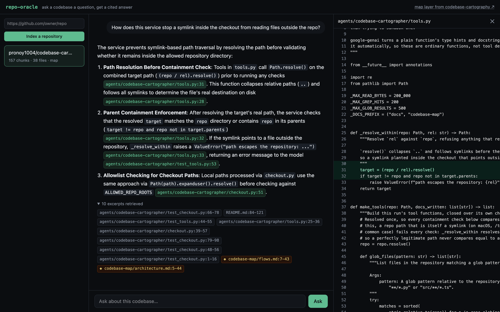
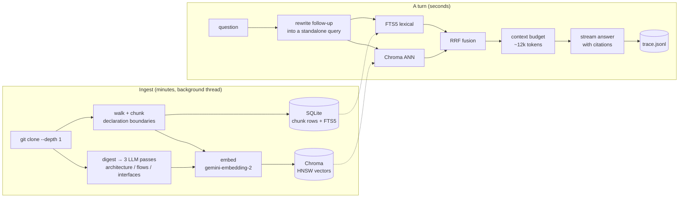
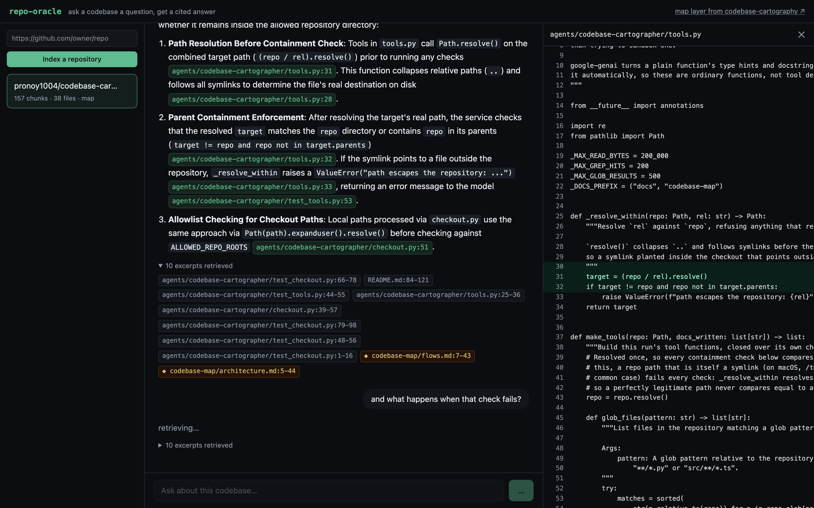
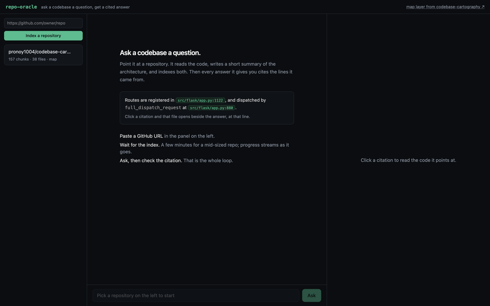
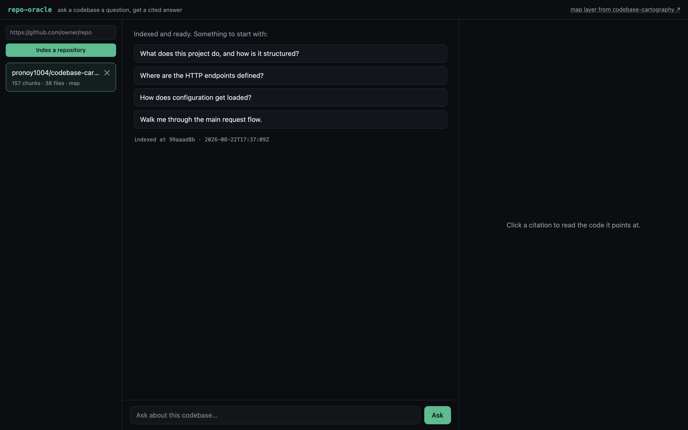

# repo-oracle

Ask a codebase a question, get an answer with `path:line` citations you can click.

Point it at a GitHub URL. It clones the repo, chunks it along declaration boundaries,
embeds the chunks, writes a short architectural summary of the whole repository, and indexes
both. Then you talk to it. Every claim in an answer carries a citation, and clicking one
opens that file at that line beside the answer.



<sub>Answering a question about its own predecessor repo. Every green chip is a clickable
citation; the panel on the right is the cited file opened at the cited line. The amber chips
are the map tier.</sub>

Built for the AI-FDE assignment, option 2 (code documentation assistant).

---

## Quick start

You need Docker and a Gemini API key. The key is free: https://aistudio.google.com/apikey

```bash
git clone https://github.com/pronoy1004/repo-oracle && cd repo-oracle
echo "GEMINI_API_KEY=your-key" > .env
docker compose up --build
```

Open http://localhost:8000, paste a GitHub URL in the left panel, wait for the index, ask
questions. A repo the size of Flask takes about four minutes on the free tier, and most of
that is the embedding rate limit rather than any work we are doing (see
[Rate limits](#rate-limits)).

One caveat I should state rather than let you find: I do not have Docker on this machine, so
the image is written and reviewed but never built. The path below is the one I actually ran
end to end, and it is what every screenshot and eval number in this README came from.

Without Docker:

```bash
python3 -m venv .venv && .venv/bin/pip install -r requirements-dev.txt
export GEMINI_API_KEY=your-key
.venv/bin/uvicorn repo_oracle.app:app --port 8000        # API on :8000
cd web && npm install && npm run dev                     # UI on :5173, proxies to :8000
```

Tests, which need no key and touch no network:

```bash
.venv/bin/python -m pytest -q
```

---

## Architecture



| File | What it owns |
|---|---|
| [`repo_oracle/checkout.py`](repo_oracle/checkout.py) | Getting a repo on disk safely. Scheme allowlist, ref validation, local-path allowlist. |
| [`repo_oracle/chunk.py`](repo_oracle/chunk.py) | Walking the tree and cutting files into chunks. |
| [`repo_oracle/index.py`](repo_oracle/index.py) | Both stores: Chroma for the vectors, SQLite + FTS5 for chunks and lexical search, RRF over the two. |
| [`repo_oracle/mapper.py`](repo_oracle/mapper.py) | The repository-summary tier. |
| [`repo_oracle/chat.py`](repo_oracle/chat.py) | A turn: rewrite, retrieve, build context, stream a cited answer. |
| [`repo_oracle/ingest.py`](repo_oracle/ingest.py) | Orchestration and progress events. |
| [`repo_oracle/app.py`](repo_oracle/app.py) | HTTP and SSE. |
| [`repo_oracle/trace.py`](repo_oracle/trace.py) | One JSON line per turn. |
| [`web/`](web) | React UI: repos, chat, source panel. |

---

## The decisions, and why

### Two tiers of retrieval, because questions come in two shapes

The first thing I did was write down the questions people actually ask when they join a
team, and they split cleanly:

- *"Where is the rate limiting done?"* Answerable from one chunk. Classic RAG is good at this.
- *"How does a request get from the router to the database?"* Not answerable from any chunk,
  because the answer is not written down anywhere. It is spread across a route, a
  middleware, a service and a model, and an embedding of the question is not close to any
  one of them.

Chunk retrieval alone fails the second shape, and the failure is the bad kind: it returns
five plausible chunks and the model writes a confident, wrong narrative over them. So
ingestion writes the missing documents. Three passes over a digest of the repository produce
an architecture note, a flows note and an interfaces note, and those get chunked and indexed
alongside the code with `tier="map"`. Now the second shape has something to retrieve.

The map tier gets two reserved slots in the retrieved set rather than a score boost, and the
prompt tells the model to prefer source excerpts when both say the same thing, so the
summaries orient the answer without becoming the authority. The reserved-slot design came
out of the evals catching me: see [Quality](#quality). The summaries are the one part
of the system that can be wrong in a way the code cannot, so they are marked `[map]` in the
prompt and in the UI, and they are cheap to regenerate.

Those three prompts are condensed from the SKILL.md files of an earlier project of mine,
[codebase-cartography](https://github.com/pronoy1004/codebase-cartography). More on that at
the bottom.

### Chunking on declarations, not on token counts

A function cut in half retrieves badly and reads worse when it lands in the context window.
Code has visible boundaries that prose does not, so I split on them: a per-language regex
finds top-level `def`, `class`, `func`, `impl` and friends, small neighbours merge so a
three-line function is not its own chunk, and anything oversized falls back to overlapping
windows. Unknown languages get windows only.

This is a regex, not a parser, and the file says so in a comment. Tree-sitter would be more
correct and costs a grammar per language plus a build step. The regex covers about a dozen
languages and degrades to something usable, not something broken, everywhere else. If eval
hit rate ever drops because of a chunking mistake, that is when the grammar earns its keep.

Every chunk carries `path:start-end` as the first line of what gets embedded. The location
is part of what makes a chunk relevant, since half of "where is the router configured" is a
path question, and it means any retrieved chunk can be cited without a second lookup.

### Chroma for the vectors, SQLite for everything else

Dense vectors go in Chroma, an embedded vector database with an HNSW index. Chunk rows, the
metadata and the lexical half live in SQLite. Two stores, each doing the job it is good at.

How I got here is more useful to read than a clean-sounding justification. My first build had
no vector database: embeddings as blobs in a SQLite table and a brute-force numpy matmul for
cosine. At this scale that is genuinely fast, and I argued for it. What changed my mind is
that it is the wrong thing to own. Nearest-neighbour search is a solved problem with mature
implementations, and hand-rolled brute force is the version that quietly gets worse: fine at
20k vectors, mediocre at 100k, and by the time it hurts you are rewriting retrieval in the
middle of something else. Chroma is one dependency and brings a real ANN index, metadata
filtering and persistence, none of which I want to maintain my own version of.

What I refused to give up was the one-command setup. Chroma runs embedded, in-process, so
there is still no service to operate on a single node. Qdrant or pgvector are the same design
with a container in front, and moving to either means changing `_client` and `search_dense`
and nothing above them, because everything upstream consumes ranks rather than scores.

What it cost, honestly. One more dependency, and not a small one. Two stores to keep
consistent instead of one, which is why `add` commits SQLite before Chroma: written that way,
a crash leaves a chunk that dense search cannot reach but lexical search still finds, rather
than a Chroma id that resolves to nothing, which would be a silent wrong answer. And HNSW is
approximate, so recall is no longer exactly 100% the way a full scan was.

Chunk text deliberately stays out of Chroma. Storing it in both places doubles the disk for
nothing, since a hit is resolved by id and SQLite already has the row.

### Hybrid retrieval, fused by RRF

Dense retrieval alone is bad at exactly the queries developers type. Ask for `REDIS_URL` or
`UserSerializer` and you want exact match, and an embedding model helpfully blurs the
identifier into "something about caching". Lexical alone is bad at the questions where the
asker does not know the vocabulary yet, which is most questions on day one.

So both run, and Reciprocal Rank Fusion merges them. RRF instead of weighted score
normalisation because BM25 ranks and cosine similarities live on scales that are not
comparable, and any normalisation constant that works today needs retuning per corpus and
will not get it. RRF reads ranks only and has one constant that nothing is sensitive to.

The lexical side needed one piece of care: FTS5 has its own query language and a user
question is not written in it. `fts_query` strips stopwords, quotes each term, ORs them, and
splits `getUserById` into its parts so it also matches a file that only says
`get_user_by_id`.

### Model choices

**Gemini Flash for generation, `gemini-embedding-001` at 768 dimensions for retrieval.**
Everything goes through litellm, so both are `provider/model` strings and switching to
Anthropic or OpenAI is an env var. The default is Gemini for one reason that beats the
others: it has a genuinely free tier, so whoever reads this can run it without provisioning
a paid key. On my own key I would run Sonnet for generation, which is better at the "trace
this through four files" answers.

Two things I had to find out the hard way and would not have guessed:

- `gemini-embedding-001` returns 3072 dimensions by default. It is trained with Matryoshka
  representation learning, so truncating to 768 keeps most of the retrieval quality at a
  quarter of the memory and a quarter of the matmul. That is a free 4x and I take it.
- Gemini Flash is a thinking model by default, and thinking tokens bill against
  `max_tokens`. A 2048-token budget can be spent entirely on reasoning and return an empty
  string, which is exactly what happened on my first run. `reasoning_effort="disable"` fixes
  it. This is grounded synthesis over excerpts I already retrieved, not a puzzle, so the
  thinking bought nothing and cost latency on every turn.
- That fix then broke a different model: Gemini 2.0 Flash rejects `reasoning_effort`
  outright. litellm's `drop_params` strips parameters a given provider will not take, which
  is what keeps `ORACLE_MODEL` a real choice rather than the three models I happened to
  test. Worth knowing before writing "any provider works" in a README.

### Prompt and context management

The system prompt in `chat.py` does three jobs, and I kept them separate so each can be
changed without disturbing the others: ground the answer in the excerpts, cite constantly,
treat the excerpts as data rather than instructions.

The grounding rule is the one that matters. The failure mode I am defending against is not
invented syntax, it is a confident answer about how the framework *usually* works when this
repository does something else. So the rule is explicit: if the excerpts do not contain the
answer, say so, say what you did find, and name what to look at next.

Context is budgeted at roughly 12k tokens, estimated at four characters per token. Not a
tokenizer: that is a dependency and a per-provider difference, and the budget only needs to
be right to within about 15% because the chunk it drops is the least relevant one. One
refinement that earns its three lines: a single oversized chunk is skipped rather than
allowed to end the loop, so one 400-line file cannot starve five good small ones.

Conversation state lives server side, keyed by session, last 20 messages, last 6 sent to the
model. Follow-ups get rewritten into standalone queries before retrieval, which is the
single highest-leverage part of the whole turn: "and how does it handle errors?" retrieves
nothing on its own, because its subject is in the previous message. If the rewrite call
fails, the turn proceeds with the raw question. Degraded, not broken.

### Guardrails

| Risk | What is actually done |
|---|---|
| Cloning something that is not a repo | Only `http`/`https`. `file://` and `ssh://` let git read local paths or run a local command. |
| Git ref used as an argument injection | Refs match a strict regex, so a leading `-` cannot become an option. Also never passed through a shell. |
| Reading the host filesystem | Local paths are refused unless `ALLOWED_REPO_ROOTS` names them. Unset by default, and unset in the container. |
| Path traversal and symlinks | Paths are resolved before the containment check, so `..` and symlinks are caught. |
| Secrets in the index | `.env`, `*.pem`, `*.key` and friends are indexed by name with the contents replaced by a placeholder. The prompt also forbids printing a credential value. |
| Prompt injection from the repo | Excerpts are labelled as untrusted data. A file that addresses the model gets reported and quoted, not obeyed. This one is a mitigation and not a guarantee, see [Limits](#limits-i-know-about). |
| Runaway ingest | Caps on files, chunks, file size and clone time. |
| Open API | `ORACLE_API_KEY` guards everything except `/healthz`. Unset means no auth, which is right for `docker run` on a laptop and wrong anywhere else. |

### Observability

Every turn writes one JSON line to `data/traces.jsonl`: the question, the rewritten query,
every retrieved chunk with its score, tier and which retriever found it, how much context
was used, the citations parsed out of the answer, and per-stage latency. `GET /traces/recent`
reads them back.

This exists because RAG fails quietly. The answer is fluent and the retrieval was wrong, and
you cannot tell which from the transcript. The trace answers the only question worth asking
first when someone reports a bad answer: did retrieval miss, or did the model ignore what it
was given? Those are different bugs with different fixes.

It is JSONL on local disk, which is OpenTelemetry minus the collector. The record shape maps
onto spans one for one the day this runs somewhere that has one.

### Quality

`evals/questions.json` is 18 hand-written questions about a fixed public repository, each
labelled with the files a human would open to answer it. `evals/run.py` scores hit rate at
k, top-1 hit rate, and MRR.

It scores retrieval, not the generated answer, on purpose. Answer quality is expensive to
judge and moves with the model. Retrieval either put the right file in the window or it did
not, and every answer failure that matters starts there. If the right file was never
retrieved, no prompt fix rescues it.

Eighteen questions I checked myself beat two hundred generated ones nobody has read. I used
this set to pick the map-tier weight: I ran it at 1.0, 1.15 and 1.5 and kept the best.

```bash
.venv/bin/python evals/run.py --k 5
```

Current numbers, 18 questions against `pronoy1004/codebase-cartography`, Chroma + FTS5:

```
questions      18
hit@5          94%
top-1 hit      44%
MRR            0.66
```

The one miss is "how are skills loaded into the system prompt?", which returns three chunks
of the README instead of `agent.py`. The README explains that mechanism in prose and the code
does it in one line, so the prose wins on similarity. A re-ranker is the fix.

Top-1 at 44% with hit@5 at 94% is the expected shape rather than a problem: the right file is
nearly always in the window, and the model reads every excerpt, not only the first. Top-1 is
the number a re-ranker moves, which is why it is first on the list of what I would add next.

**The evals caught two bad ideas of mine, which is the reason they exist.** Both were about
how the map tier reaches the model, and both looked reasonable on paper:

| Design | hit@5 | MRR |
|---|---|---|
| Score boost for map chunks (x1.15) | 89% | 0.43 |
| Reserved map slots inside the top k | 89% | 0.59 |
| Map slots in addition to the top k | 94% | 0.66 |

The mistake is the same one twice: I let summaries compete with source files for the same
slots. They answer different questions, so `search` now returns k code chunks plus up to two
summaries, and the context budget absorbs the difference. Neither bad version was visible in
the answers, which all read fine.

One honesty note on the comparison. The earlier brute-force build scored hit@5 100% and MRR
0.64 on these same questions, so hit@5 lost one question while MRR and top-1 went up. I
cannot cleanly attribute that, because the move to Chroma and a change of embedding model
(the free tier's daily quota on the old one ran out mid-work) landed together. Two variables,
one measurement, so I report it rather than claim the vector store improved anything.

```bash
.venv/bin/python evals/run.py --k 5
```

Current numbers, 18 questions against `pronoy1004/codebase-cartography`:

```
questions      18
hit@5          100%
top-1 hit      39%
MRR            0.64
```

Top-1 at 39% with hit@5 at 100% is the expected shape and not a problem: the right file is
always in the window, and the model reads all eight excerpts rather than only the first.
Top-1 is what a re-ranker would move, which is why a re-ranker is first on the list of what
I would add next.

**The evals caught a bad idea of mine, which is the reason they exist.** My first design
gave map-tier chunks a 1.15 score multiplier so the summaries would surface. Run against the
question set, that scored hit@5 89% and MRR 0.43, down from 100% and 0.65 without the map
tier at all. The boosted summaries were pushing real source files out of the top five. The
fix was to stop letting the two tiers compete: map chunks get two reserved slots and code
fills the rest. Back to 100% and 0.64, with the summaries still in the context window. I
would not have caught that by reading answers, because the answers with the bad weighting
still looked fine.

---

## Rate limits

Gemini's free tier bills embeddings per input rather than per batched call, and cuts you off
at 100 per minute. That is the one limit this system actually hits, and it hits it during
ingest, hard. So ingest paces itself (`ORACLE_EMBED_RPM`, default 90) instead of discovering
the 429 halfway through a repository. On a paid key, set `ORACLE_EMBED_RPM=1500` and ingest
gets about fifteen times faster.

Generation has a separate daily cap, and I hit it while building. When it trips, the map
passes fail and ingest finishes with tier 1 only, saying so in the progress log, and a turn
returns the retrieved files with a note instead of an answer. Both are deliberate: degrade,
report, keep the useful part. If you see it, either wait for the quota to reset or point
`ORACLE_MODEL` at another model.

---

## Productionizing this

What I would change, roughly in the order I would change it.

**Stop doing ingest in a thread.** It is a background thread inside the API process today,
which is fine for one user and wrong the moment there are two: a restart loses in-flight
work and a big repo starves the event loop's thread pool. Ingest becomes a queue (SQS or
Cloud Tasks) and a worker pool that scales separately from the API, because the two have
completely different resource shapes. Ingest is a long CPU-and-network job; a turn is a
two-second burst.

**Move both stores off local disk.** Embedded Chroma and per-repo SQLite are local files,
which pin a repo to a machine. Two ways out, and I would pick by team rather than by
benchmark: run Chroma in server mode and point the client at it, which is a URL change and
leaves the code identical; or consolidate on Aurora Postgres with pgvector, one table,
`repo_id` as the partition key, `tsvector` for the lexical half, so both halves live in one
store with one backup story. I lean to the second for anything long-lived, because one
database to operate beats two. Checkouts stay on ephemeral local disk, since they are deleted
after ingest anyway.

**Cache embeddings by content hash.** Two repos that vendor the same library, or the same
repo re-indexed at a new commit, re-embed everything today. Keyed by chunk hash in Redis or
DynamoDB, a re-index of a repo with ten new commits costs almost nothing. This is the single
biggest cost saving available and it is maybe thirty lines.

**Incremental re-indexing.** `git diff` between the indexed commit and HEAD gives the changed
files; delete their chunks, re-chunk, re-embed those only. Ingest goes from minutes to
seconds and the map stays fresh, which is what makes this usable as a thing a team keeps
running rather than a thing someone runs once.

**Auth and tenancy.** A static API key is a demo control. Real deployment needs per-user
identity, per-repo access control that mirrors the source host's permissions (a private repo
someone indexed must not be readable by everyone), and per-tenant rate limits.

**Deployment shape.** One container, so: ECS Fargate or Cloud Run behind an ALB, with SSE
needing the load balancer's idle timeout raised and response buffering off. Static assets to
S3 and CloudFront rather than served by uvicorn. Secrets from Secrets Manager, not env vars
in a task definition. Traces to CloudWatch or an OTel collector instead of a local file,
which is the one code change on this list.

**What I would watch in production.** Retrieval hit rate on a golden set run nightly against
the current model, p95 turn latency split by stage, cost per turn, and the rate of answers
containing the "I could not find that" phrasing, which is the cheapest available proxy for
retrieval quality dropping.

The container and compose file here are real and the app runs from them. I did not deploy it
anywhere, because a hosted demo on my own free-tier key would be rate limited into
uselessness by the second visitor, and the assignment asks what productionizing would
require rather than for a live URL.

---

## Engineering standards

**Followed.** Every module has a header that says why it exists, not what it does. Comments
explain decisions, since the code already explains the mechanism. The trust boundary is one
module (`checkout.py`) plus one function (`_resolve_within`), and both have tests that are
specifically about refusals. Tests run offline: the two functions in `llm.py` are the only
calls that leave the process, so stubbing them exercises everything else for real, including
real SQLite, real FTS5 and real fusion. Failure modes degrade rather than throw: a failed
rewrite, a failed embed, a failed map pass all continue with less. The container runs as a
non-root user with no host mounts.

**Skipped, deliberately.** No type checker in CI, no linter config, no pre-commit hooks: for
a repo this size they are ceremony, and I would add them on day one of a second contributor.
No auth beyond a shared key. No structured logging framework, since JSONL and `print` are
enough at this size. No streaming ingest progress persisted across restarts, so a restart
mid-ingest loses the job. No retry queue. Sessions are a dict, so they are lost on restart
and would not survive a second process.

**One thing I got wrong and fixed.** The first ingest run died halfway through on a rate
limit, I re-ran it, and every retrieval started returning each chunk twice, because the
second run appended to the existing index instead of replacing it. That is now an unlink
before open, plus a test that asserts a re-ingest replaces rather than appends. It is in the
repo as a test rather than a comment because that is the kind of bug that comes back.

---

## Limits I know about

- **Prompt injection is mitigated, not solved.** A file that instructs the model gets quoted
  and reported rather than obeyed, and this holds for the obvious cases. I would not stake
  anything on it against a determined attacker, and the real defence is that this system has
  no write tools and no shell, so the worst outcome is a wrong answer.
- **The chunker is regex-based** and will mis-split unusual formatting. It degrades to
  windows rather than failing.
- **The map tier can be wrong.** It is model output about the repository rather than the
  repository itself. It is labelled `[map]` everywhere it appears so that it is never
  mistaken for source.
- **Very large repos are truncated** at 4,000 files and 12,000 chunks, and the UI says so.
- **The source panel reassembles files from chunks**, since the checkout is deleted after
  ingest. Skipped files (binaries, lockfiles, minified bundles) cannot be opened.
- **No re-ranker.** A cross-encoder over the top 40 would measurably improve precision. It
  is the first thing I would add with more time.
- **HNSW is approximate.** Dense recall is no longer exactly 100% the way a full scan was. At
  this corpus size I cannot measure the difference, and the eval numbers come from the real
  store, but it is a property of the design rather than something I can argue away.
- **Two stores can drift.** SQLite commits before Chroma, so an interrupted ingest can leave
  chunks only lexical search reaches. There is no reconciliation pass; a re-ingest is the
  repair, and it drops both stores first.

---

## What I would do next

In priority order, which is roughly value divided by effort:

1. **A cross-encoder re-ranker** over the fused top 40. This is the highest-value single
   change to answer quality and it is one API call per turn.
2. **Incremental re-indexing from a git diff.** Turns this from a one-shot tool into
   something a team leaves running against its own repos.
3. **Agentic follow-up retrieval.** Let the model request a specific file or grep when the
   first retrieval is thin, instead of answering from what it happened to get. This is the
   piece my earlier project does well and this one does not, and it is the natural next step:
   retrieval as a tool call rather than a fixed pre-step.
4. **Symbol graph.** Parse imports and definitions to answer "who calls this" and "what
   breaks if I change this", which retrieval alone answers badly at any k.
5. **Answer evals, not just retrieval evals.** A rubric judge over the same question set,
   scoring citation accuracy specifically. Verifying that a cited line actually contains the
   claim is mechanical and worth automating.
6. **Embedding cache by content hash**, per the productionizing notes.

---

## How I used AI tools building this

I used Claude Code throughout, and the way I used it is more particular than "I asked it to
write the code".

**I planned first, in writing, before any code existed.** The architecture, the two-tier
idea, the store choice and the rejected alternatives were decided by me and written into a
plan document, and the model built against that plan. Every decision in this README is one I
made and can defend in a conversation. That is the whole point: an unplanned AI session
produces code that works and that nobody, including the person who shipped it, can explain.

**I kept a bias toward less code.** My standing instruction to the assistant is to reach for
the standard library before a dependency, a native feature before a library, and one line
before fifty. Stdlib `sqlite3` FTS5 over a search service, hand-parsed SSE over another
client library, no orchestration framework. That instinct has a limit and this project found
it: I first wrote my own brute-force vector search to avoid a dependency, and that was the
wrong call, because nearest-neighbour search is somebody else's solved problem and my version
would only have got worse. Reaching for less code is a default, not a rule. The default failure mode of AI
coding assistants is not wrong code, it is *too much* code: a factory here, a config layer
there, an abstraction over one implementation. Left unchecked it produces a codebase that
looks professional and costs a week to understand.

**I wrote the prose.** This README, the module headers and the comments that explain a
decision are mine. The model is good at describing what code does and bad at saying why it
is that way, because it was not in the room when the choice was made. Anything that reads
like reasoning here is reasoning I did.

**I made it check its own work.** Real end-to-end runs against a real key, not just unit
tests. That is how the two most interesting bugs surfaced: the embedding rate limit, and the
thinking budget eating `max_tokens` and returning an empty answer. Neither was findable by
reading code, and neither would have been found by an assistant left to mark its own
homework.

**Repeatability.** The parts I want repeated live in the repo, not in a chat history: the
evals, the tests, and comments that carry the reason and the upgrade path. The prompts that
build the map tier are in `mapper.py` as constants, so they can be diffed and reviewed like
any other code. My earlier project takes this further by packaging the method as reusable
skills, which is what let me lift the summarization prompts into this one in an afternoon.

**My rules, briefly.** Do: plan before generating, review every diff, make it write a test
for anything with a branch in it, run it against reality. Don't: accept an abstraction I did
not ask for, let it name things (it reaches for `manager`, `handler`, `service`), let it
write the reasoning, or let it "improve" working code without a reason I can state.

---

## Prior work: codebase-cartography

I should be direct about this, since the overlap is real. I had already built
[codebase-cartography](https://github.com/pronoy1004/codebase-cartography), which solves an
adjacent problem: it is an agentic documentation generator that crawls a repository with
grep, glob and read tools and writes a full set of markdown maps into `docs/codebase-map/`.
It is a set of Agent Skills plus a small service.

It is not this assignment. It generates documents in one shot and has no chat, no retrieval
index, no embeddings and no multi-turn state. Answering "where is the rate limiting done" by
re-crawling the repository with an agent costs a hundred tool calls and a minute; answering
it from an index costs one embedding and 300 ms. Those are different systems.

What I carried across:

- `checkout.py` almost verbatim, since the scheme allowlist, the ref regex and the local-path
  allowlist were already right and rewriting them would have been a way to introduce a bug.
- The path containment approach, resolve before checking so symlinks are caught, and its
  tests.
- The framing that repository contents are untrusted data, which is a real risk in both
  systems and is worded almost identically in both prompts.
- The three map-tier prompts, condensed from that project's `map-architecture`, `trace-flows`
  and `map-apis` skills. Vendored as prompt text in `mapper.py` rather than called over the
  network, so this repo stands alone.

What I deliberately did not carry across: the agent loop. Giving the model filesystem tools
and letting it explore is the right design for writing documentation and the wrong one for
answering a question in two seconds. Retrieval-as-a-tool-call is on the "what next" list
above as a hybrid of the two, and that is the interesting version of this system.

---

## More screenshots

A follow-up question, showing that "and what happens when that check fails?" was resolved
against the previous turn before retrieval ran:



The cold start, which is the screen a first-time visitor actually lands on. It shows what a
cited answer looks like rather than describing it:



And once a repository is selected:



---

## API

Everything except `/healthz` takes `X-API-Key` when `ORACLE_API_KEY` is set.

| Method | Path | Purpose |
|---|---|---|
| `GET` | `/healthz` | Liveness. |
| `POST` | `/repos` | Start an ingest. `{"url": "...", "ref": null, "kind": "git"}`. Returns a `repo_id`. |
| `GET` | `/repos` | Indexed repos and in-flight ingests. |
| `GET` | `/repos/{id}/events` | SSE ingest progress. Replayed from the start on connect. |
| `GET` | `/repos/{id}/file?path=` | A file's text, reassembled from the index. |
| `DELETE` | `/repos/{id}` | Drop an index. |
| `POST` | `/chat` | SSE: `sources`, then `token` frames, then `done` with citations. |
| `DELETE` | `/chat/{session}` | Forget a conversation. |
| `GET` | `/traces/recent` | The last N turn traces. |

```bash
curl -N -X POST localhost:8000/chat -H 'content-type: application/json' \
  -d '{"repo_id":"flask-1a2b3c4d","message":"where are routes registered?"}'
```

## Design docs

[PRODUCT.md](PRODUCT.md) carries the strategic context (who this is for, what it claims, the
principles that decide arguments) and [DESIGN.md](DESIGN.md) carries the visual system
(palette with measured contrast, type scale, component states, motion rules). They exist so
that a change to this interface can be argued against something written down rather than
against taste.

## Configuration

| Variable | Default | Purpose |
|---|---|---|
| `GEMINI_API_KEY` | required | Or the key matching whichever provider `ORACLE_MODEL` names. |
| `ORACLE_MODEL` | `gemini/gemini-flash-latest` | Any litellm `provider/model`. |
| `ORACLE_EMBED_MODEL` | `gemini/gemini-embedding-2` | Changing this invalidates existing indexes. |
| `ORACLE_EMBED_DIMS` | `768` | Matryoshka truncation. |
| `ORACLE_EMBED_RPM` | `90` | Ingest pacing. Raise on a paid key. |
| `ORACLE_API_KEY` | unset | When set, required on every route but `/healthz`. |
| `ORACLE_DATA_DIR` | `data` | Where the SQLite files, the Chroma store and the traces live. |
| `ORACLE_MAX_FILES` / `ORACLE_MAX_CHUNKS` | `4000` / `12000` | Ingest caps. |
| `ORACLE_SKIP_MAP` | unset | Skip the map tier. Faster ingest, worse architectural answers. |
| `ALLOWED_REPO_ROOTS` | unset | Colon-separated directories that may be ingested as local paths. |

MIT.
