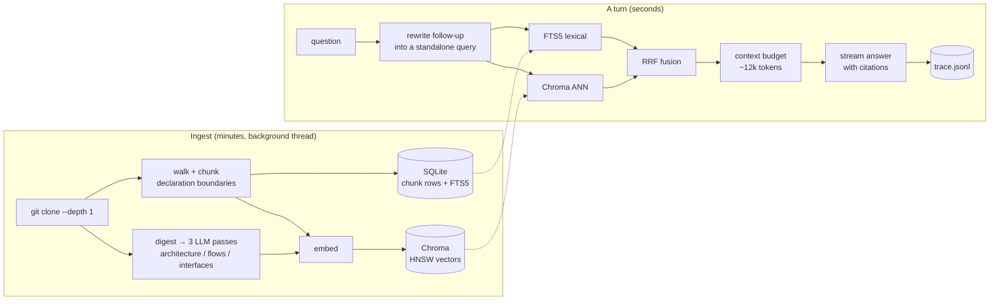

# repo-oracle

Ask a codebase a question, get an answer with `path:line` citations you can click.

Point it at a GitHub URL. It clones the repo, chunks it along declaration boundaries, embeds
the chunks, writes a short architectural summary of the whole repository, and indexes both.
Then you talk to it. Clicking a citation opens that file at that line beside the answer.

Built for the AI-FDE assignment, option 2.


**[42-second demo video](docs/demo.mp4)**: ask, read a cited answer, open a citation, ask a
follow-up that only makes sense in context, then ask something the repo has no answer for and
watch it decline instead of inventing one.

## Quick start

Needs Docker and a Gemini key, free from https://aistudio.google.com/apikey

```bash
git clone https://github.com/pronoy1004/repo-oracle && cd repo-oracle
echo "GEMINI_API_KEY=your-key" > .env
docker compose up --build
```

Open http://localhost:8000, paste a GitHub URL, wait for the index, ask. A repo the size of
Flask takes about four minutes, nearly all of it the free tier's embedding rate limit.

I have no Docker on this machine, so the image is written and reviewed but never built. The
path below is the one I ran end to end, and every screenshot and number here came from it.

```bash
python3 -m venv .venv && .venv/bin/pip install -r requirements-dev.txt
export GEMINI_API_KEY=your-key
.venv/bin/uvicorn repo_oracle.app:app --port 8000    # API
cd web && npm install && npm run dev                 # UI on :5173
```

Tests need no key and touch no network: `.venv/bin/python -m pytest -q`

## Architecture



| File | Owns |
|---|---|
| [`checkout.py`](repo_oracle/checkout.py) | Getting a repo on disk safely |
| [`chunk.py`](repo_oracle/chunk.py) | Walking the tree, cutting files into chunks |
| [`index.py`](repo_oracle/index.py) | Chroma for vectors, SQLite + FTS5 for chunks, RRF over both |
| [`mapper.py`](repo_oracle/mapper.py) | The repository-summary tier |
| [`chat.py`](repo_oracle/chat.py) | A turn: rewrite, retrieve, budget, stream |
| [`ingest.py`](repo_oracle/ingest.py) | Orchestration and progress events |
| [`app.py`](repo_oracle/app.py) | HTTP and SSE |
| [`trace.py`](repo_oracle/trace.py) | One JSON line per turn |
| [`web/`](web) | React UI: repos, chat, source panel |

Each module opens with a comment explaining why it exists. Those are the long-form version of
everything below.

## Decisions

| Decision | Considered | Chose | Why |
|---|---|---|---|
| LLM | Claude Sonnet, GPT-4o-class, local Llama, Gemini Flash | **Gemini Flash** via litellm | Only one with a free tier good enough to run this without a paid key |
| Embeddings | OpenAI, Voyage `voyage-code-3`, local `bge`, Gemini | **`gemini-embedding-2`** at 768 dims | Same key as the LLM, so setup halves |
| Vector DB | numpy brute force, Chroma, Qdrant, pgvector | **Chroma**, embedded | Real ANN index, no service to operate |
| Lexical | skip it, Elasticsearch, SQLite FTS5 | **FTS5**, in stdlib | Half of code questions are identifier lookups |
| Orchestration | LangChain, LlamaIndex, Haystack, none | **None** | The pipeline is six functions |
| Chunking | fixed windows, tree-sitter, declaration regex | **Regex** with window fallback | Code has visible boundaries; a parser per language is not paid for yet |

### Two tiers, because questions come in two shapes

"Where is the rate limiting done?" is answerable from one chunk. Classic RAG is good at it.

"How does a request get from the router to the database?" is not, because that answer is not
written down anywhere. It lives across a route, a middleware, a service and a model, and an
embedding of the question is close to none of them. Chunk retrieval returns five plausible
chunks and the model writes a confident, wrong story over them.

So ingestion writes the missing documents. Three passes over a digest of the repo produce an
architecture note, a flows note and an interfaces note, indexed alongside the code as
`tier="map"`. Now the second question shape has something to hit.

Those prompts are condensed from an earlier project of mine,
[codebase-cartography](https://github.com/pronoy1004/codebase-cartography). More on that at
the bottom.

### Chunking on declarations

A function cut in half retrieves badly and reads worse in the context window. Code has
visible boundaries that prose does not, so I split on them: a per-language regex finds
top-level `def`, `class`, `func`, `impl` and friends, small neighbours merge so a three-line
function is not its own chunk, and anything oversized falls back to overlapping windows.

It is a regex, not a parser, and the file says so. Tree-sitter is more correct and costs a
grammar per language plus a build step. If eval hit rate ever drops because of a chunking
mistake, that is when the grammar earns its keep.

Every chunk carries `path:start-end` as the first line of what gets embedded. Half of "where
is the router configured" is a path question, and it means any hit can be cited without a
second lookup.

### Chroma for vectors, SQLite for the rest

My first build had no vector database: embeddings as blobs in SQLite and a numpy matmul for
cosine. At 20k chunks that is a few milliseconds, faster than a network hop, and I argued for
it.

I changed my mind because it is the wrong thing to own. Nearest-neighbour search is solved,
and hand-rolled brute force is the version that quietly degrades: fine at 20k vectors,
mediocre at 100k, and by then you are rewriting retrieval in the middle of something else.
Chroma is one dependency and brings an ANN index, metadata filtering and persistence.

It runs embedded, so there is still no service to operate on one node. Qdrant and pgvector
are the same design with a container in front, and moving to either means changing `_client`
and `search_dense`, nothing above them.

What it cost: one large dependency, two stores to keep consistent, and approximate rather
than exact recall. `add` commits SQLite before Chroma on purpose. That order can leave a
chunk only lexical search reaches; the reverse leaves a vector id resolving to nothing, which
is a silent wrong answer.

### Hybrid retrieval, fused by RRF

Dense retrieval is bad at exactly the queries developers type. Ask for `REDIS_URL` or
`UserSerializer` and you want exact match, but an embedding blurs the identifier into
"something about caching". Lexical is bad at questions where the asker does not know the
vocabulary yet, which is most questions on day one.

Both run, and Reciprocal Rank Fusion merges them. RRF rather than weighted scores because
BM25 ranks and cosine similarities are not comparable, and any normalising constant needs
retuning per corpus and will not get it. RRF reads ranks only.

One piece of care on the lexical side: FTS5 has its own query language and a question is not
written in it. `fts_query` strips stopwords, quotes each term, ORs them, and splits
`getUserById` so it also matches a file that says `get_user_by_id`.

### No orchestration framework

The decision I expect to be questioned hardest, so here is the reasoning.

I looked at LangChain and LlamaIndex properly. Both give you a loader, a splitter, a
vector-store adapter, a retriever interface and a chain. Against what this system does, that
is a git clone, a file walk, a regex splitter, one `collection.add`, one `collection.query`,
a rank fusion and a prompt. Six functions, none longer than a screen.

A framework buys swappability I do not need yet and a vocabulary a new hire knows. It costs
an abstraction between me and the two things that decide whether this works: exactly what
text goes into the embedding, and exactly what goes into the context window.
`Chunk.embed_text()` is four lines and I can read it.

The specific failure I avoided: a retriever that normalises scores to rank hybrid results,
when the whole reason my fusion works is that it never compares a BM25 score to a cosine
similarity.

Where the answer flips: the moment this needs agentic retrieval, with the model deciding to
grep, read a file, then search again, a tool-calling loop is real infrastructure and worth
adopting rather than writing. litellm is an adapter at the boundary, not a skeleton through
the middle.

### Models

Claude Sonnet is the better model for tracing a mechanism across four files and staying
honest about what the excerpts do not say. It is what I would run on my own key. A local
Llama removes the API dependency and I rejected it: worse on grounded synthesis, and it makes
you install a model server before you see anything. Gemini Flash won on one criterion that
beat the rest for a submission, a free tier you can get in a minute.

For embeddings, Voyage `voyage-code-3` is trained on code and is probably the best retrieval
quality here, at the price of a second vendor account. A local `bge` costs nothing per call
and removes the rate limit that shapes ingest, at the price of a large download in the image.
Gemini won because it is the same key as the LLM.

Three things I found the hard way:

1. Gemini embeddings return 3072 dimensions by default. Matryoshka training means truncating
   to 768 keeps most of the quality at a quarter of the memory. Free 4x.
2. Gemini Flash thinks by default, and thinking tokens bill against `max_tokens`. A 2048
   budget got spent entirely on reasoning and returned an empty string on my first run.
   `reasoning_effort="disable"` fixes it. This is grounded synthesis, not a puzzle.
3. That fix broke a different model, since Gemini 2.0 Flash rejects the parameter outright.
   litellm's `drop_params` is what keeps `ORACLE_MODEL` a real choice rather than the three
   models I happened to test.

### Prompt and context management

The system prompt does three jobs, kept separate so each can change alone: ground the answer
in the excerpts, cite constantly, treat the excerpts as data rather than instructions.

Grounding is the one that matters. The failure I am defending against is not invented syntax,
it is a confident answer about how the framework usually works when this repository does
something else. So the rule is explicit: if the excerpts do not contain the answer, say so,
say what you did find, and name what to read next.

Context is budgeted at 12k tokens, estimated at four characters per token. Not a tokenizer:
that is a dependency and a per-provider difference, and the budget only needs to be right
within about 15% because the chunk it drops is the least relevant one. One refinement earns
its three lines: an oversized chunk is skipped rather than allowed to end the loop, so one
400-line file cannot starve five good small ones.

Conversation state lives server side, last 20 messages, last 6 sent to the model. Follow-ups
are rewritten into standalone queries before retrieval, which does more for answer quality
than anything else in a turn. "And how does it handle errors?" retrieves nothing on its own. If the rewrite call
fails, the turn proceeds with the raw question.

### Guardrails

| Risk | What is done |
|---|---|
| Cloning something that is not a repo | Only `http`/`https`. `file://` and `ssh://` let git read local paths or run a command |
| Ref used as argument injection | Strict regex, so a leading `-` cannot become an option. Never through a shell |
| Reading the host filesystem | Local paths refused unless `ALLOWED_REPO_ROOTS` names them. Unset by default and in the container |
| Traversal and symlinks | Paths resolved before the containment check |
| Secrets in the index | `.env`, `*.pem`, `*.key` indexed by name, contents replaced by a placeholder |
| Prompt injection from the repo | Excerpts labelled untrusted. A file addressing the model gets quoted and reported, not obeyed |
| Runaway ingest | Caps on files, chunks, file size, clone time |
| Open API | `ORACLE_API_KEY` guards everything but `/healthz`. Unset means no auth, right for a laptop and wrong anywhere else |

### Observability

Every turn writes one JSON line to `data/traces.jsonl`: the question, the rewritten query,
every retrieved chunk with score, tier and which retriever found it, context size, citations
parsed from the answer, and per-stage latency. `GET /traces/recent` reads them back.

RAG fails quietly. The answer is fluent and the retrieval was wrong, and the transcript will
not tell you which. The trace answers the first question worth asking when someone reports a
bad answer: did retrieval miss, or did the model ignore what it was given? Different bugs,
different fixes.

It is JSONL on local disk, which is OpenTelemetry minus the collector. The record shape maps
onto spans the day this runs somewhere that has one.

### Quality

`evals/questions.json` is 18 hand-written questions about a fixed public repo, each labelled
with the files a human would open to answer it. `evals/run.py` scores hit rate at k, top-1,
and MRR.

It scores retrieval, not the generated answer. Answer quality is expensive to judge and moves
with the model. Retrieval either put the right file in the window or it did not, and every
answer failure that matters starts there.

```
questions      18      hit@5   94%
top-1 hit      44%     MRR     0.66
```

The one miss returns three chunks of the README instead of `agent.py`, because the README
explains that mechanism in prose and the code does it in one line. A re-ranker is the fix,
and it is what moves top-1 generally.

**The evals caught two bad ideas of mine, which is why they exist.** Both were about how the
map tier reaches the model:

| Design | hit@5 | MRR |
|---|---|---|
| Score boost for map chunks (x1.15) | 89% | 0.43 |
| Reserved map slots inside the top k | 89% | 0.59 |
| Map slots in addition to the top k | 94% | 0.66 |

The same mistake twice: I let summaries compete with source files for the same slots. Neither
bad version was visible in the answers, which read fine both times.

One honesty note. The earlier brute-force build scored hit@5 100% and MRR 0.64 on these
questions, so hit@5 lost one question while MRR and top-1 went up. I cannot attribute that
cleanly, because moving to Chroma and changing embedding model landed together. Two
variables, one measurement, so I report it rather than claim the vector store improved
anything.

## Rate limits

Gemini's free tier bills embeddings per input, not per batched call, and cuts you off at 100
a minute. That is the one limit this system hits, and it hits it during ingest. So ingest
paces itself (`ORACLE_EMBED_RPM`, default 90). On a paid key, set it to 1500 and ingest gets
about fifteen times faster.

Generation has a separate daily cap, which I hit while building. When it trips, map passes
fail and ingest finishes with tier 1 only, saying so in the log, and a turn returns the
retrieved files with a note instead of an answer. Both are deliberate: degrade, report, keep
the useful part.

## Productionizing

In the order I would do it.

1. **Stop doing ingest in a thread.** Fine for one user, wrong for two: a restart loses
   in-flight work and a big repo starves the event loop's thread pool. Ingest becomes a queue
   (SQS or Cloud Tasks) and workers that scale separately from the API. Ingest is a long
   CPU-and-network job; a turn is a two-second burst.
2. **Move both stores off local disk.** Embedded Chroma and per-repo SQLite pin a repo to a
   machine. Either run Chroma in server mode, a URL change, or consolidate on Aurora Postgres
   with pgvector: one table, `repo_id` as partition key, `tsvector` for the lexical half. I
   lean to the second for anything long-lived, because one database to operate beats two.
3. **Cache embeddings by content hash.** Two repos vendoring the same library, or the same
   repo at a new commit, re-embed everything today. Keyed in Redis or DynamoDB, a re-index
   after ten commits costs almost nothing. Biggest saving available, about thirty lines.
4. **Incremental re-indexing.** `git diff` between the indexed commit and HEAD gives changed
   files; delete their chunks and re-embed those only. Minutes become seconds, which is what
   makes this a thing a team leaves running rather than runs once.
5. **Auth and tenancy.** A static key is a demo control. Real deployment needs per-user
   identity, per-repo access mirroring the source host's permissions, and per-tenant limits.

Deployment shape: one container, so ECS Fargate or Cloud Run behind an ALB, with the load
balancer's idle timeout raised and response buffering off for SSE. Static assets to S3 and
CloudFront. Secrets from Secrets Manager. Traces to CloudWatch or an OTel collector, the one
code change on this list.

What I would watch: retrieval hit rate on the golden set run nightly, p95 turn latency by
stage, cost per turn, and the rate of "I could not find that" answers, the cheapest proxy for
retrieval quality dropping.

The container and compose file are real. I did not deploy anywhere, because a hosted demo on
a free-tier key would be rate limited into uselessness by the second visitor.

## Engineering standards

**Followed.** Every module has a header saying why it exists, not what it does. The trust
boundary is one module plus one function, both with tests specifically about refusals. Tests
run offline: the two functions in `llm.py` are the only calls that leave the process, so
stubbing them exercises everything else for real, including SQLite, FTS5, Chroma and fusion.
Failure modes degrade rather than throw. The container runs as non-root with no host mounts.
[PRODUCT.md](PRODUCT.md) and [DESIGN.md](DESIGN.md) hold the design context, so a change to
the interface can be argued against something written down.

**Skipped.** No type checker or linter in CI, no pre-commit hooks: ceremony at this size, and
day-one work with a second contributor. No auth beyond a shared key. No structured logging
framework. Ingest progress does not survive a restart. Sessions are a dict, so they die with
the process.

**One thing I got wrong.** The first ingest died halfway on a rate limit, I re-ran it, and
every retrieval started returning each chunk twice, because the second run appended instead
of replacing. That is now an unlink before open, plus a test. It is a test rather than a
comment because that bug comes back.

## Limits

- **Prompt injection is mitigated, not solved.** The real defence is that this system has no
  write tools and no shell, so the worst outcome is a wrong answer.
- **The chunker is regex-based** and will mis-split unusual formatting. It degrades to
  windows rather than failing.
- **The map tier can be wrong.** It is model output about the repo, not the repo. Labelled
  `[map]` everywhere it appears.
- **Very large repos are truncated** at 4,000 files and 12,000 chunks.
- **The source panel rebuilds files from chunks**, since the checkout is deleted after
  ingest. Skipped files cannot be opened.
- **HNSW is approximate**, so dense recall is no longer exactly 100%. Not measurable at this
  size, but a property of the design.

## What I would do next

1. **A cross-encoder re-ranker** over the fused top 40. Highest-value single change to answer
   quality, one API call per turn.
2. **Incremental re-indexing from a git diff.** Turns a one-shot tool into something a team
   leaves running.
3. **Agentic follow-up retrieval.** Let the model request a file or a grep when the first
   retrieval is thin. This is the piece my earlier project does well and this one does not.
4. **Symbol graph.** Parse imports and definitions to answer "who calls this", which
   retrieval answers badly at any k.
5. **Answer evals, not just retrieval evals.** A rubric judge scoring citation accuracy.
   Verifying that a cited line contains the claim is mechanical and worth automating.

## How I used AI tools

I used Claude Code throughout, and how matters more than whether.

**I planned first, in writing.** The architecture, the two-tier idea, the store choice and
the rejected alternatives were decided by me and written into a plan before code existed.
Every decision here is one I can defend in conversation. An unplanned AI session produces
code that works and that nobody, including the person who shipped it, can explain.

**I kept a bias toward less code.** Stdlib FTS5 over a search service, hand-parsed SSE over
another client library, no orchestration framework. The default failure of AI assistants is
not wrong code, it is too much code: a factory here, a config layer there, an abstraction
over one implementation. Left alone it produces a codebase that looks professional and costs
a week to understand. That instinct has a limit, and this project found it. I first wrote my
own brute-force vector search to avoid a dependency, and that was the wrong call.

**I wrote the prose.** This README, the module headers, the comments that explain a decision.
The model is good at describing what code does and bad at saying why it is that way, because
it was not in the room when the choice was made.

**I made it check its own work against reality.** Real runs against a real key, not just unit
tests. That is how the two most interesting bugs surfaced: the embedding rate limit, and the
thinking budget eating `max_tokens` and returning an empty answer. Neither was findable by
reading code.

**Repeatability.** The parts I want repeated live in the repo, not in a chat history: the
evals, the tests, comments carrying the reason and the upgrade path. The map-tier prompts are
constants in `mapper.py`, so they diff and review like any other code.

**Do:** plan before generating, review every diff, demand a test for anything with a branch,
run it against reality. **Don't:** accept an abstraction I did not ask for, let it name
things (it reaches for `manager`, `handler`, `service`), let it write the reasoning, or let
it improve working code without a reason I can state.

## Prior work

I had already built
[codebase-cartography](https://github.com/pronoy1004/codebase-cartography), an agentic
documentation generator that crawls a repo with grep and read tools and writes markdown maps.

It is not this assignment. It generates documents in one shot, with no chat, no index, no
embeddings, no multi-turn state. Answering "where is the rate limiting done" by re-crawling
with an agent costs a hundred tool calls and a minute. From an index it costs one embedding
and 300ms. Different systems.

Carried across: `checkout.py` almost verbatim, since the scheme allowlist, ref regex and path
allowlist were already right and rewriting them would have been a way to add a bug. The path
containment approach and its tests. The framing that repository contents are untrusted. The
three map-tier prompts, condensed from its `map-architecture`, `trace-flows` and `map-apis`
skills.

Deliberately not carried across: the agent loop. Filesystem tools and exploration is right
for writing documentation and wrong for answering in two seconds. Retrieval as a tool call is
the interesting hybrid, and it is on the list above.

## More screenshots

The cold start, the screen a first-time visitor lands on:


A follow-up, where "and what happens when that check fails?" was resolved against the
previous turn before retrieval ran:


## API

Everything but `/healthz` takes `X-API-Key` when `ORACLE_API_KEY` is set.

| Method | Path | Purpose |
|---|---|---|
| `GET` | `/healthz` | Liveness |
| `POST` | `/repos` | Start an ingest. Returns a `repo_id` |
| `GET` | `/repos` | Indexed repos and in-flight ingests |
| `GET` | `/repos/{id}/events` | SSE ingest progress, replayed from the start |
| `GET` | `/repos/{id}/file?path=` | A file's text, rebuilt from the index |
| `DELETE` | `/repos/{id}` | Drop an index |
| `POST` | `/chat` | SSE: `sources`, then `token` frames, then `done` |
| `DELETE` | `/chat/{session}` | Forget a conversation |
| `GET` | `/traces/recent` | The last N turn traces |

## Configuration

| Variable | Default | Purpose |
|---|---|---|
| `GEMINI_API_KEY` | required | Or the key matching `ORACLE_MODEL`'s provider |
| `ORACLE_MODEL` | `gemini/gemini-flash-latest` | Any litellm `provider/model` |
| `ORACLE_EMBED_MODEL` | `gemini/gemini-embedding-2` | Changing this invalidates existing indexes |
| `ORACLE_EMBED_DIMS` | `768` | Matryoshka truncation |
| `ORACLE_EMBED_RPM` | `90` | Ingest pacing. Raise on a paid key |
| `ORACLE_API_KEY` | unset | When set, required on every route but `/healthz` |
| `ORACLE_DATA_DIR` | `data` | SQLite files, the Chroma store, traces |
| `ORACLE_MAX_FILES` / `ORACLE_MAX_CHUNKS` | `4000` / `12000` | Ingest caps |
| `ORACLE_SKIP_MAP` | unset | Skip the map tier |
| `ALLOWED_REPO_ROOTS` | unset | Directories that may be ingested as local paths |

MIT.
