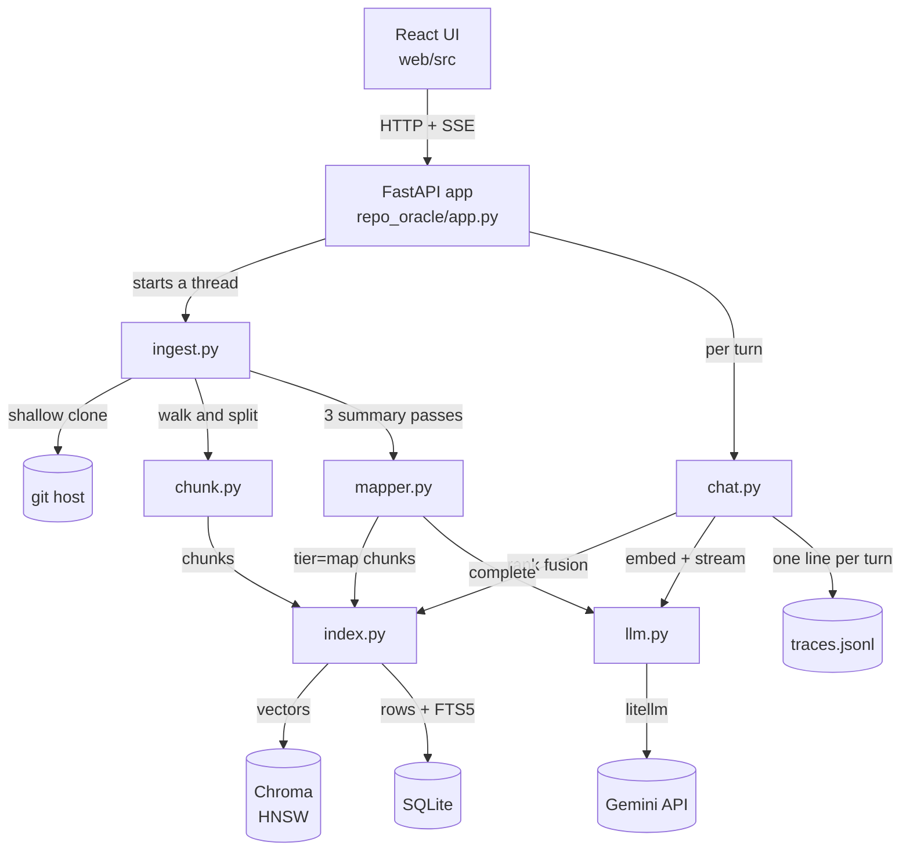
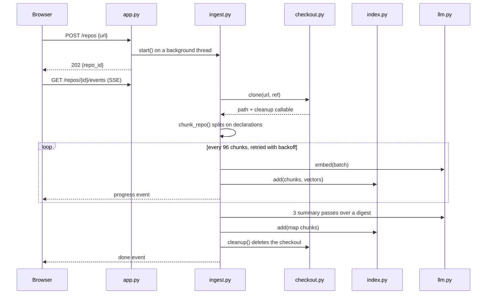
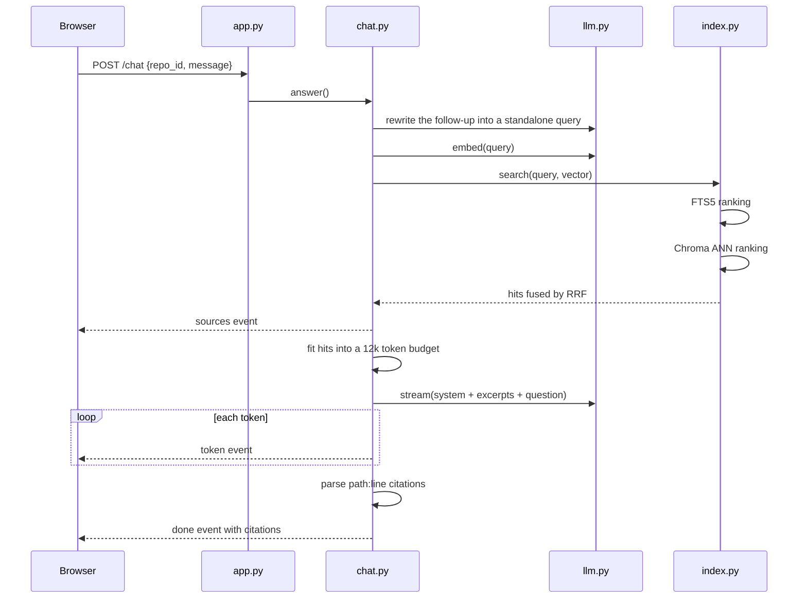
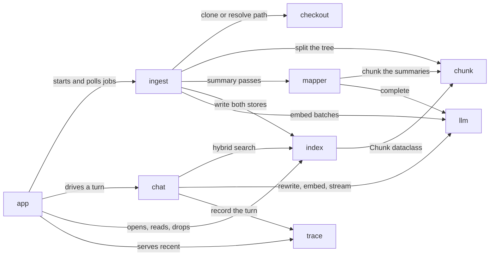
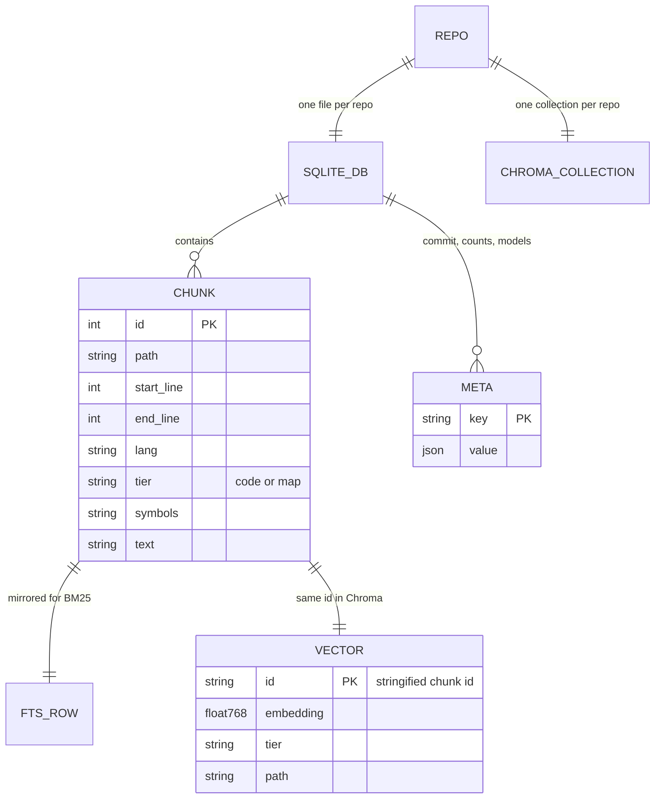

# Diagrams

Generated with [`draw-diagrams`](https://github.com/pronoy1004/codebase-cartography/blob/main/skills/draw-diagrams/SKILL.md),
an Agent Skill from my [codebase-cartography](https://github.com/pronoy1004/codebase-cartography)
project, pointed at this repo. Every block renders in GitHub.

## System components

The two stores are the only state that outlives a request. The checkout is deleted when
ingest finishes.

## Flow: ingest a repository

Each batch commits as it lands, so a rate limit costs the remaining batches, not the run.

## Flow: a chat turn

Retrieval is reported to the browser before generation starts, so a wrong answer can be
blamed on the right stage.

## Module dependencies

No cycles. `llm.py` is the only module that reaches the network, which is what makes the
test suite offline.

## Data model

A chunk id is the join key across both stores, which is why SQLite is written first.
